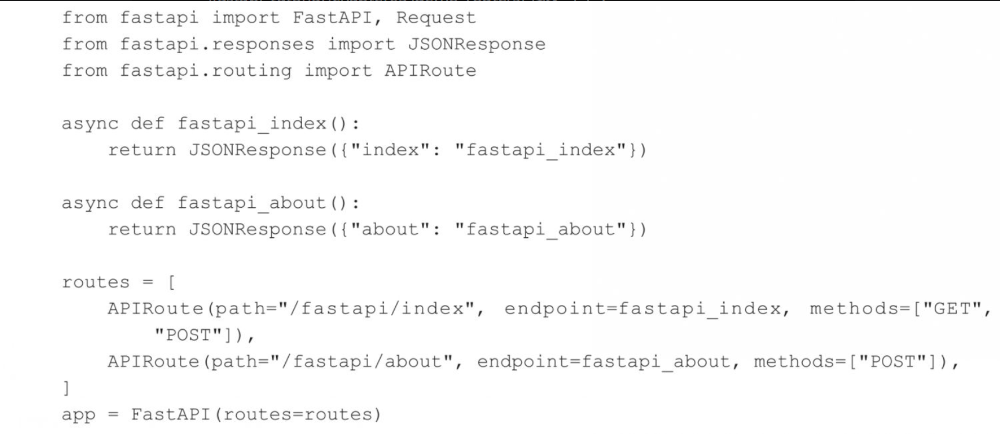

# app 应用配置参数详解

从 FastAPI 包中导入 FastAPI 类后进行相关的实例化后，app 对象就是整个服务应用的实例对象

这个 FastAPI 类包含了很多的参数项，而且其中的参数多数起到全局作用，这里介绍一些常用的：

- debug：利用 debug 可以实现在网页中看到错误堆栈信息明细的功能

  ```python
  app = FastAPI(debug=True)
  ```

  

## 全局 routes 参数说明

在对 FastAPI 类进行实例化时，有一个预设的 routes 路由列表参数，保存了 app 中所有 api 端点的路由信息



# 全局异常/错误捕获

exception_handlers 参数主要用于捕获在执行业务逻辑处理过程中抛出的各种异常

```python
async def exception_not_found(request, exc):
    return JSONResponse(
    	"code": exc.status_code,
        "error": "not found"
        status_code=exc.status_code
    )

exception_handlers = {
    404: exception_not_found,
}
app = FastAPI(exception_handlers=exceptio)
```

